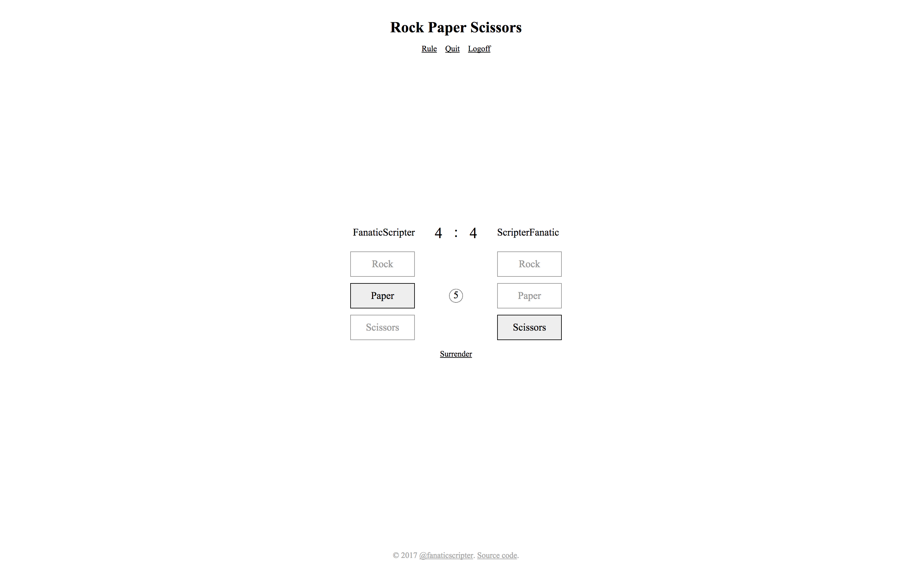
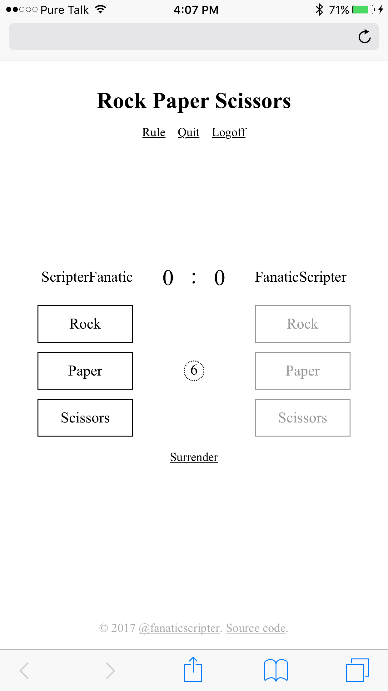

# Rock Paper Scissors Online

I wrote this tiny web app in order to learn and have a little bit of practice
with WebSocket and Python 3.6 `asyncio`.

## Dependencies

Python 3.6 or later is required (the app was developed against Python 3.6). The
only package dependency is [`websockets`](https://github.com/aaugustin/websockets)
(the app was developed against v3.2).

## How to

There are two components to this app:

### WebSocket server component

`rps-websocket-server.py` is the WebSocket server. You need to copy
`conf.ini.template` to `conf.ini` and adjust the configuration variables
as documented. Then,

```sh
python3.6 -m venv venv
. venv/bin/activate
pip install -r requirements.txt
./rps-websocket-server.py
```

### Static component

Static files can be built with

```sh
./build
```

You can now serve the `_build` directory with whatever web server you
choose. Note that you may need to modify the port number in `rps.js`
before running the build script if the port specified in `conf.ini` is
not 8443.

## Notes

- The WebSocket server processes all requests in a single thread with a single
  event loop. The current implementation is not scalable to multiple threads.

- Despite being single-threaded, the server can and does serve a theoretically
  unlimited number of connections. Matches are made in a first-come-first-serve
  basis; every two waiting users are automatically paired with each
  other. Paring with a selected user is currently not supported. (We don't even
  persist uids or forbid name conflicts at the moment.)

- The WebSocket server binds to port 8443/8080 instead of 443/80 by default,
  because the `websockets` package
  [does not handle HTTP](https://github.com/aaugustin/websockets/issues/116),
  although it should be possible. (The port and even the hostname of the
  WebSocket server can be changed at will though, as long as `rps.js`
  knows where to find the host.)

- An autoplay bot is trivial to implement:

  ```js
  setInterval(function () { var move = Math.floor(Math.random() * 3); $('.button.clickable[data-move=' + move + ']').click(); }, 1000)
  ```

## Screenshots

Google Chrome:

<div align="center"></div>

iOS Safari:

<div align="center"></div>

## License

Copyright (c) 2017 Z. Wang <fanaticscripter@gmail.com>

This work is free. You can redistribute it and/or modify it under the
terms of the Do What The Fuck You Want To Public License, Version 2,
as published by Sam Hocevar.
